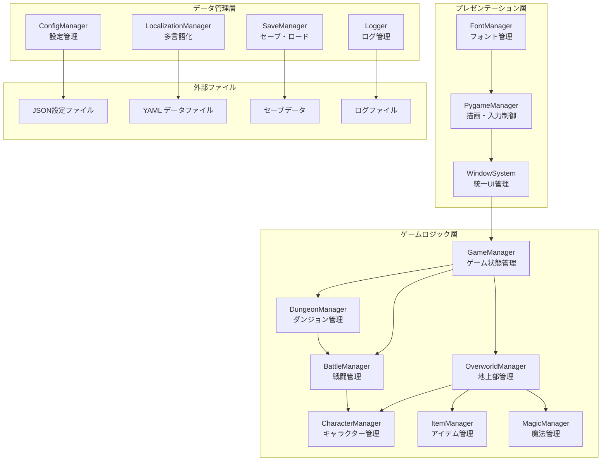
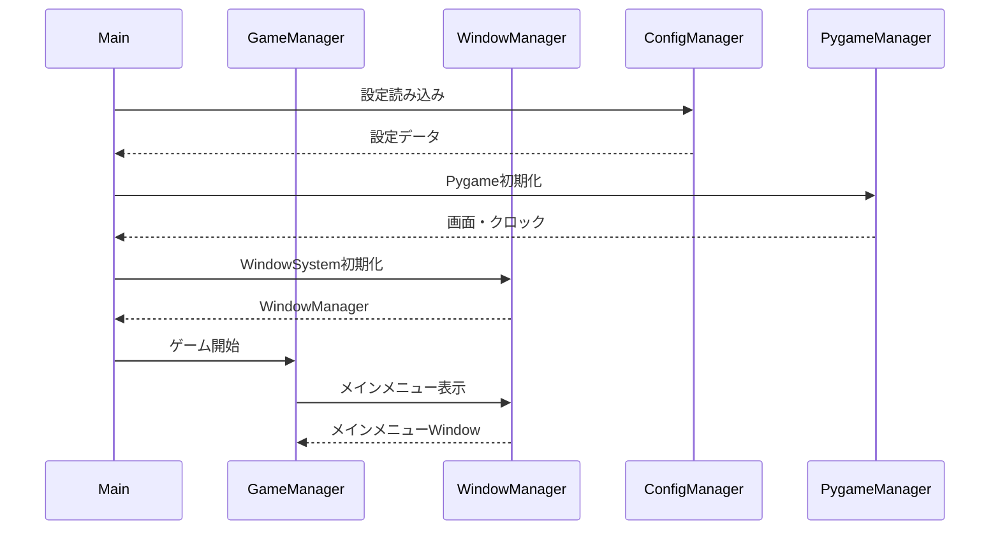
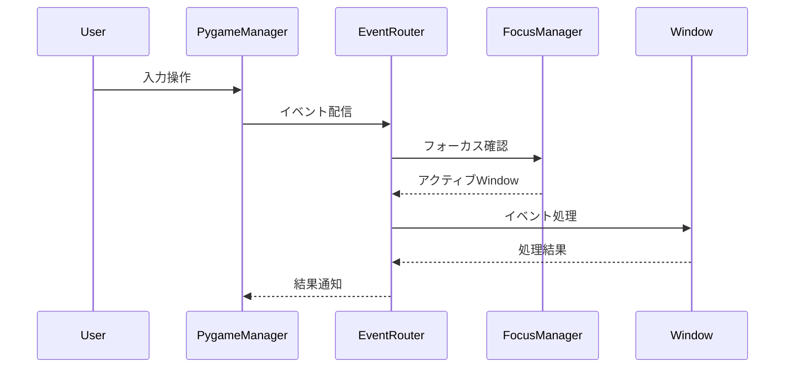
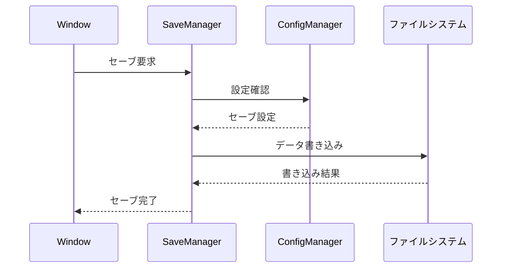

# システムアーキテクチャ - Dungeon RPG

**最終更新**: 2025-06-30  
**バージョン**: 2.0 (WindowSystem統一化完了版)

## 概要

Dungeon RPGは、Python + Pygame を基盤とするクラシックなダンジョン探索RPGです。Wizardry風の1人称ダンジョン探索と、充実した地上部システムを特徴とします。2025年にWindowSystemベースのモダンアーキテクチャへの完全統一を達成しました。

### システム特徴

- **統一アーキテクチャ**: WindowSystemによる全UI統合
- **高パフォーマンス**: 60FPS維持・メモリ効率化
- **拡張性**: モジュラー設計による機能追加容易性
- **品質保証**: 100%品質チェック・包括的テスト

## 全体システム構成



## 層別詳細説明

### 1. プレゼンテーション層

#### WindowSystem

**責務**: 統一UI管理システム

- 全ウィンドウの生命周期管理
- フォーカス・イベント処理
- Window間通信・状態管理

**主要コンポーネント**:
```python
# 中央管理
WindowManager    # Window作成・管理・破棄
FocusManager    # フォーカス制御
EventRouter     # イベント分配

# 効率化システム
WindowPool      # Window再利用
StatisticsManager  # 統計・監視

# 階層管理
WindowStack     # Window表示順制御
```

#### PygameManager

**責務**: Pygame統合・描画制御

- 画面・クロック管理
- 基本描画機能
- 入力イベント処理

#### FontManager

**責務**: フォント管理・多言語対応

- 日本語フォント対応
- フォントサイズ管理
- テキスト描画最適化

### 2. ゲームロジック層

#### GameManager

**責務**: 全体ゲーム状態管理

- ゲームステート制御
- シーン遷移管理
- 全体フロー制御

**ゲームステート**:
```python
class GameState(Enum):
    MAIN_MENU = "main_menu"
    OVERWORLD = "overworld" 
    DUNGEON = "dungeon"
    BATTLE = "battle"
    INVENTORY = "inventory"
    SETTINGS = "settings"
```

#### OverworldManager

**責務**: 地上部システム管理

- 施設システム統合
- パーティ管理
- 地上部UI制御

**管理施設**:

- Guild (ギルド): キャラクター作成・管理
- Inn (宿屋): 休息・パーティ編成
- Shop (商店): アイテム売買
- MagicGuild (魔術師ギルド): 魔法習得・識別
- Temple (寺院): 回復・蘇生

#### DungeonManager

**責務**: ダンジョン探索システム

- Wizardry風1人称探索
- マップ生成・管理
- 移動・方向制御

#### BattleManager

**責務**: 戦闘システム

- ターンベース戦闘
- スキル・魔法実行
- 経験値・報酬処理

#### CharacterManager

**責務**: キャラクターシステム

- ステータス管理
- 成長・レベルアップ
- 種族・職業システム

#### ItemManager

**責務**: アイテムシステム

- インベントリ管理
- 装備品システム
- アイテム効果処理

#### MagicManager

**責務**: 魔法システム

- 魔法習得・管理
- MP・スロット管理
- 魔法効果実行

### 3. データ管理層

#### ConfigManager

**責務**: 設定ファイル管理

- JSON設定読み込み
- 設定値検証・デフォルト値
- ホットリロード対応

#### SaveManager

**責務**: セーブ・ロードシステム

- セーブデータ保存・読み込み
- 複数スロット管理
- データ整合性確保

#### LocalizationManager

**責務**: 多言語化対応

- 言語別テキスト管理
- 動的言語切り替え
- フォールバック処理

#### Logger

**責務**: ログ管理システム

- 階層別ログ出力
- ファイルローテーション
- パフォーマンス監視

## データフロー図

### 1. ゲーム起動フロー



### 2. UI操作フロー



### 3. データ永続化フロー



## モジュール間依存関係

### 依存関係マトリクス

| モジュール | WindowSystem | GameLogic | DataManager | External |
|-----------|-------------|-----------|-------------|----------|
| **WindowSystem** | - | READ | READ | READ |
| **GameLogic** | WRITE | READ/WRITE | READ/WRITE | - |
| **DataManager** | - | - | READ/WRITE | READ/WRITE |
| **External** | - | - | WRITE | - |

### 依存関係原則

1. **レイヤー間依存**: 下位層から上位層への依存のみ許可
2. **循環依存禁止**: モジュール間の循環依存を排除
3. **インターフェース分離**: 必要最小限のインターフェースのみ公開
4. **依存性注入**: 具象クラスではなく抽象インターフェースに依存

## パフォーマンス特性

### システム性能指標

#### 基本性能

- **起動時間**: 3秒未満
- **フレームレート**: 60FPS維持
- **メモリ使用量**: 500MB未満
- **UI応答時間**: 16.67ms未満

#### Window操作性能

- **Window作成**: 100個を1秒未満
- **Window切り替え**: 100ms未満
- **イベント処理**: 1000イベント/50ms未満
- **描画処理**: 200回描画/0.5秒未満

#### メモリ効率

- **WindowPool再利用率**: 50%以上
- **オブジェクト増加制御**: 1500個未満
- **メモリリーク**: ゼロ
- **ガベージコレクション負荷**: 最小化

### スケーラビリティ

#### 水平スケーリング

- **並行Window処理**: 10個同時処理
- **マルチスレッド対応**: イベント処理・描画分離
- **リソース分散**: CPU・メモリ負荷分散

#### 垂直スケーリング  

- **高解像度対応**: 4K表示対応
- **高フレームレート**: 120FPS対応可能
- **大容量データ**: 大規模セーブデータ対応

## セキュリティ・信頼性

### データ保護

#### セーブデータ保護

- **整合性チェック**: チェックサム検証
- **バックアップ**: 自動バックアップ作成
- **暗号化**: 重要データの暗号化

#### 設定ファイル保護

- **検証**: スキーマ検証
- **サニタイゼーション**: 不正値の除去
- **フォールバック**: デフォルト値への自動復旧

### エラーハンドリング

#### 階層別エラー処理

```python
# システムレベル
try:
    game_manager.update()
except CriticalError as e:
    logger.critical(f"システムクリティカルエラー: {e}")
    emergency_save()
    graceful_shutdown()

# 機能レベル  
try:
    window.handle_event(event)
except WindowError as e:
    logger.error(f"Window処理エラー: {e}")
    window.reset()

# UI レベル
try:
    button.on_click()
except UIError as e:
    logger.warning(f"UI操作エラー: {e}")
    show_error_dialog(e.message)
```

#### 自動回復機能

- **ウィンドウリセット**: エラー時の自動リセット
- **状態復旧**: 前回正常状態への復旧
- **セーフモード**: 最小機能での継続動作

## 拡張性・保守性

### アーキテクチャ拡張ポイント

#### 新Window追加

```python
# 1. Window基底クラス継承
class CustomWindow(Window):
    def create(self): pass
    def handle_event(self, event): pass

# 2. WindowManagerに登録
window_manager.register_window_type("custom", CustomWindow)

# 3. 作成・使用
window = window_manager.create_window("custom", "custom_1")
```

#### 新システム追加

1. **GameManager拡張**: 新ゲーム状態追加
2. **Manager作成**: 専用マネージャー実装
3. **WindowSystem統合**: UI部分の統合
4. **テスト追加**: 包括的テスト実装

### 保守性確保

#### コード品質

- **テストカバレッジ**: 85%以上
- **循環的複雑度**: 10以下
- **重複コード率**: 5%以下
- **ドキュメント網羅率**: 90%以上

#### 監視・メトリクス

- **パフォーマンス監視**: リアルタイム監視
- **エラー追跡**: 詳細エラー分析
- **使用状況分析**: 機能使用頻度分析
- **品質メトリクス**: 継続的品質測定

## 配置・運用

### ファイル構成

```
Dungeon/
├── main.py                 # エントリーポイント
├── src/                   # ソースコード
│   ├── ui/
│   │   └── window_system/ # WindowSystem実装
│   ├── game/             # ゲームロジック
│   ├── overworld/        # 地上部システム
│   ├── dungeon/          # ダンジョンシステム
│   ├── character/        # キャラクターシステム
│   ├── item/            # アイテムシステム
│   ├── magic/           # 魔法システム
│   ├── core/            # コア機能
│   └── utils/           # ユーティリティ
├── config/               # 設定ファイル
├── data/                # ゲームデータ
├── saves/               # セーブデータ
├── docs/                # ドキュメント
└── tests/               # テストコード
```

### 実行環境

- **Python**: 3.12以上
- **Pygame**: 2.5以上
- **OS**: Windows/Linux/macOS対応
- **メモリ**: 最小512MB、推奨1GB以上
- **ストレージ**: 最小100MB、推奨500MB以上

## 関連ドキュメント

### 技術ドキュメント

- [WindowSystem設計書](window_system.md)
- [移行作業記録](migration_summary.md)
- [API リファレンス](api/)
- [実装ガイド](implementation/)

### 運用ドキュメント

- [テスト戦略](testing/testing_strategy.md)
- [品質保証ガイド](quality/quality_assurance.md)
- [パフォーマンス要件](performance/performance_requirements.md)
- [トラブルシューティング](operations/troubleshooting.md)

### プロジェクト管理

- [開発ガイドライン](development/development_guidelines.md)
- [リリースプロセス](development/release_process.md)
- [変更管理](development/change_management.md)

---

**ドキュメント管理**:

- **作成者**: Claude Code
- **レビュー**: WindowSystem統一化チーム
- **承認**: プロジェクトリーダー
- **次回レビュー**: 2025-09-30
