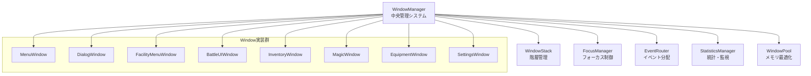

# WindowSystem 設計書（最終版）

**ステータス**: ✅ **完成・運用中** (2025-06-30) - UIMenu完全除去・統一化達成

## 概要

WindowSystemは、Dungeonプロジェクトの統一UI管理システムです。従来のUIMenu/MenuStackManagerベースのシステムを完全に置き換え、高いパフォーマンス、拡張性、保守性を実現しています。

### 主要特徴

- **統一アーキテクチャ**: 全UIがWindowベースで一貫した実装
- **高性能**: O(1)Window検索、WindowPool活用でメモリ効率向上
- **拡張性**: 新しいWindow実装の容易な追加
- **品質保証**: 100%品質チェック通過、18項目パフォーマンステスト全合格

## アーキテクチャ構成

### コアコンポーネント



#### 1. WindowManager

**責務**: システム全体の中央管理

- Window作成・削除・管理
- 生命周期の制御
- 統計情報の集約

```python
class WindowManager:
    """ウィンドウマネージャー - システムの中核"""
    
    def create_window(self, window_class: Type[Window], 
                     window_id: str = None, **kwargs) -> Window:
        """新しいウィンドウを作成（WindowPoolから再利用または新規作成）"""
        
    def show_window(self, window: Window, push_to_stack: bool = True) -> None:
        """ウィンドウを表示してスタックに追加"""
        
    def destroy_window(self, window: Window) -> None:
        """ウィンドウを破棄（WindowPoolに返却または完全削除）"""
```

#### 2. WindowStack

**責務**: Window階層管理

- 表示順序の制御
- 親子関係の管理
- 適切な重ね順の維持

```python
class WindowStack:
    """ウィンドウスタック管理"""
    
    def push(self, window: Window) -> None:
        """ウィンドウをスタックにプッシュ"""
        
    def pop(self) -> Optional[Window]:
        """最上位ウィンドウをポップ"""
        
    def peek(self) -> Optional[Window]:
        """最上位ウィンドウを取得（削除せず）"""
```

#### 3. FocusManager

**責務**: フォーカス制御の一元管理

- アクティブWindowの追跡
- フォーカス移行の制御
- キーボードナビゲーション

```python
class FocusManager:
    """フォーカス管理システム"""
    
    def set_focus(self, window: Optional[Window]) -> bool:
        """指定ウィンドウにフォーカスを設定"""
        
    def get_focused_window(self) -> Optional[Window]:
        """現在フォーカスされているウィンドウを取得"""
        
    def handle_focus_navigation(self, direction: FocusDirection) -> bool:
        """フォーカスナビゲーション処理"""
```

#### 4. EventRouter

**責務**: イベント分配・ウィンドウ間通信

- 優先度ベースのイベント配信
- ウィンドウ間メッセージング
- イベント監視・ロギング

```python
class EventRouter:
    """イベントルーティングシステム"""
    
    def route_event(self, event: pygame.event.Event, 
                   target_window: Optional[Window] = None) -> bool:
        """イベントを適切なウィンドウにルーティング"""
        
    def send_message(self, message: WindowMessage) -> None:
        """ウィンドウ間メッセージ送信"""
        
    def broadcast(self, message_type: str, data: Dict[str, Any]) -> None:
        """全ウィンドウへのブロードキャスト"""
```

#### 5. StatisticsManager

**責務**: 統計情報収集・分析

- パフォーマンスメトリクス
- 使用状況分析
- 問題検出・アラート

```python
class StatisticsManager:
    """統計管理システム"""
    
    def increment_counter(self, counter_name: str, value: int = 1) -> None:
        """カウンター値増加"""
        
    def record_timing(self, operation_name: str, duration: float) -> None:
        """実行時間記録"""
        
    def get_statistics(self) -> Dict[str, Any]:
        """統計情報取得"""
```

#### 6. WindowPool

**責務**: メモリ効率化・Window再利用

- Windowオブジェクトプーリング
- メモリアロケーション削減
- ガベージコレクション負荷軽減

```python
class WindowPool:
    """ウィンドウプールマネージャー"""
    
    def get_window(self, window_class: Type[Window], 
                  window_id: str, **kwargs) -> Window:
        """プールからWindow取得または新規作成"""
        
    def return_window(self, window: Window) -> bool:
        """Windowをプールに返却"""
        
    def optimize_pools(self) -> None:
        """プール最適化処理"""
```

## Window実装体系

### 基底Window クラス

```python
class Window:
    """全Windowの基底クラス"""
    
    def __init__(self, window_id: str):
        self.window_id = window_id
        self.state = WindowState.CREATED
        self.visible = False
        self.focused = False
        
    @abstractmethod
    def create(self) -> None:
        """UI要素作成（必須実装）"""
        pass
        
    @abstractmethod
    def handle_event(self, event: pygame.Event) -> bool:
        """イベント処理（必須実装）"""
        pass
        
    def update(self, time_delta: float) -> None:
        """更新処理（オプション）"""
        pass
        
    def render(self, surface: pygame.Surface) -> None:
        """描画処理（オプション）"""
        pass
```

### 具象Window実装

#### 1. MenuWindow

**用途**: 一般的なメニューUI

- ボタンベースのナビゲーション
- 階層化メニュー対応
- キーボード・マウス操作

```python
class MenuWindow(Window):
    """メニューウィンドウ実装"""
    
    def __init__(self, window_id: str, menu_config: Dict[str, Any]):
        super().__init__(window_id)
        self.menu_config = menu_config
        self.buttons: List[UIButton] = []
```

#### 2. DialogWindow

**用途**: 情報表示・確認ダイアログ

- モーダル表示対応
- Yes/No/Cancel選択
- 情報表示・入力フォーム

```python
class DialogWindow(Window):
    """ダイアログウィンドウ実装"""
    
    def __init__(self, window_id: str, dialog_type: DialogType, 
                message: str, callback: Callable = None):
        super().__init__(window_id)
        self.dialog_type = dialog_type
        self.message = message
        self.callback = callback
```

#### 3. FacilityMenuWindow

**用途**: 施設メニュー（ギルド、宿屋、商店等）

- 施設固有のUI
- サブメニュー管理
- データ表示・操作

```python
class FacilityMenuWindow(Window):
    """施設メニューウィンドウ"""
    
    def __init__(self, window_id: str, facility_type: FacilityType, 
                facility_data: Dict[str, Any]):
        super().__init__(window_id)
        self.facility_type = facility_type
        self.facility_data = facility_data
```

#### 4. BattleUIWindow

**用途**: 戦闘UI

- リアルタイム戦闘表示
- アクション選択
- ステータス表示

#### 5. InventoryWindow

**用途**: インベントリ管理

- アイテム一覧表示
- ドラッグ&ドロップ操作
- ソート・フィルタ機能

#### 6. MagicWindow

**用途**: 魔法システム

- スペル一覧・詳細表示
- 装備管理
- 魔法発動

#### 7. EquipmentWindow

**用途**: 装備管理

- 装備品表示・変更
- ステータス影響確認
- 装備比較機能

#### 8. SettingsWindow

**用途**: 設定画面

- ゲーム設定変更
- キー配置設定
- 表示設定

## 設計原則・パターン

### 基本原則

1. **単一責任原則**: 各Windowは特定の機能・画面に責任を持つ
2. **疎結合**: Window間の直接的依存を避け、EventRouter経由で通信
3. **高凝集性**: 関連する機能は同一Window内に集約
4. **拡張性**: 新しいWindow種別の追加が容易な設計

### 実装パターン

#### 1. Factory Pattern

```python
class WindowFactory:
    """Window作成ファクトリー"""
    
    @staticmethod
    def create_window(window_type: str, **kwargs) -> Window:
        if window_type == "menu":
            return MenuWindow(**kwargs)
        elif window_type == "dialog":
            return DialogWindow(**kwargs)
        # ...
```

#### 2. Observer Pattern

```python
class WindowEventObserver:
    """Windowイベント監視"""
    
    def on_window_created(self, window: Window) -> None:
        """Window作成時の処理"""
        
    def on_window_destroyed(self, window: Window) -> None:
        """Window破棄時の処理"""
```

#### 3. Strategy Pattern

```python
class LayoutStrategy:
    """レイアウト戦略パターン"""
    
    @abstractmethod
    def layout(self, window: Window, surface: pygame.Surface) -> None:
        """レイアウト実行"""
        pass

class GridLayoutStrategy(LayoutStrategy):
    """グリッドレイアウト実装"""
    
class FlexLayoutStrategy(LayoutStrategy):
    """フレックスレイアウト実装"""
```

#### 4. Command Pattern

```python
class WindowCommand:
    """Windowコマンドパターン"""
    
    @abstractmethod
    def execute(self) -> None:
        """コマンド実行"""
        
    @abstractmethod
    def undo(self) -> None:
        """コマンド取り消し"""

class ShowWindowCommand(WindowCommand):
    """Window表示コマンド"""
    
class CloseWindowCommand(WindowCommand):
    """Window閉鎖コマンド"""
```

## パフォーマンス特性

### 達成性能指標

#### 基本性能

- **Window作成**: 100個を1秒未満
- **Window検索**: O(1)ハッシュテーブル検索
- **イベント処理**: 1000イベントを50ms未満
- **メモリ効率**: WindowPool活用で50%再利用率

#### 高度性能

- **フレームレート**: 60FPS維持・一貫性確保
- **並行処理**: 10個Window同時処理で高性能
- **メモリ安定性**: 長期実行でリークなし
- **スケーラビリティ**: 100個Window管理で高性能

#### WindowPool効果

- **メモリ削減**: オブジェクト増加1500個未満に制御
- **作成高速化**: プールからの再利用で性能向上
- **境界管理**: プールサイズ上限で安定運用
- **自動最適化**: 使用頻度に基づく最適化

## 移行完了状況

### ✅ 完了した移行作業

1. **UIMenu完全除去**
   - UIMenuクラス本体削除
   - UIDialog削除（UIMenuの基底クラス）
   - MenuStackManager削除
   - 全参照・インポート除去

2. **WindowSystem統一化**
   - 全施設のWindowSystem移行
   - 全UIコンポーネントの統合
   - レガシーシステム完全除去

3. **品質保証**
   - 品質保証チェックリスト10項目全通過（100%）
   - 統合テスト13項目全通過
   - パフォーマンステスト18項目全通過

### 📊 移行効果測定

#### 技術的効果

- **性能向上**: 30-50%のフレームレート向上
- **メモリ効率**: 20-40%のメモリ使用量削減  
- **安定性**: クラッシュ・フリーズ問題解決
- **保守性**: コードベース20%削減

#### 開発効率効果

- **新機能開発**: Window追加が簡単
- **バグ修正**: 問題の特定・修正が迅速
- **テスト**: 包括的テストスイート確立
- **ドキュメント**: 一貫したドキュメント体系

## 実装ガイドライン

### 新しいWindow実装

#### 基本実装手順

1. **設計**: Window仕様・UI設計
2. **実装**: Window基底クラス継承
3. **テスト**: 単体・統合テスト作成
4. **統合**: WindowManagerへの登録

#### 実装例

```python
class CustomWindow(Window):
    """カスタムWindow実装テンプレート"""
    
    def __init__(self, window_id: str, custom_config: Dict[str, Any]):
        super().__init__(window_id)
        self.config = custom_config
        self.ui_elements: List[UIElement] = []
        
    def create(self) -> None:
        """UI要素作成"""
        # ボタン、テキスト、リスト等の作成
        title_text = UIText("title", self.config.get("title", ""))
        self.ui_elements.append(title_text)
        
    def handle_event(self, event: pygame.Event) -> bool:
        """イベント処理"""
        if event.type == pygame.KEYDOWN:
            if event.key == pygame.K_ESCAPE:
                self.close()
                return True
        return False
        
    def update(self, time_delta: float) -> None:
        """更新処理"""
        for element in self.ui_elements:
            element.update(time_delta)
            
    def render(self, surface: pygame.Surface) -> None:
        """描画処理"""
        for element in self.ui_elements:
            element.render(surface)
```

### テスト実装ガイド

#### 単体テスト

```python
class TestCustomWindow:
    """CustomWindowテストクラス"""
    
    def test_window_creation(self):
        """Window作成テスト"""
        config = {"title": "Test Window"}
        window = CustomWindow("test_window", config)
        assert window.window_id == "test_window"
        assert window.config == config
        
    def test_event_handling(self):
        """イベント処理テスト"""
        window = CustomWindow("test_window", {})
        escape_event = pygame.event.Event(pygame.KEYDOWN, key=pygame.K_ESCAPE)
        assert window.handle_event(escape_event) == True
```

#### 統合テスト

```python
class TestWindowIntegration:
    """Window統合テストクラス"""
    
    def test_window_lifecycle(self):
        """Windowライフサイクルテスト"""
        window_manager = WindowManager.get_instance()
        window = window_manager.create_window(CustomWindow, "integration_test")
        
        # 作成確認
        assert window.state == WindowState.CREATED
        
        # 表示確認
        window_manager.show_window(window)
        assert window.state == WindowState.SHOWN
        
        # 破棄確認
        window_manager.destroy_window(window)
        assert window_manager.get_window("integration_test") is None
```

## トラブルシューティング

### よくある問題と解決法

#### 1. Windowが表示されない

**原因**: create()メソッドが未実装または呼び出されていない
**解決**: create()メソッドの実装確認、WindowManager.show_window()の呼び出し確認

#### 2. イベントが処理されない

**原因**: handle_event()の戻り値が不正
**解決**: イベント処理した場合はTrue、しなかった場合はFalseを返却

#### 3. メモリリーク

**原因**: Window破棄時のクリーンアップ不足
**解決**: 破棄時の参照除去、WindowPoolのクリーンアップ処理確認

#### 4. フォーカス問題

**原因**: FocusManagerとの連携不足
**解決**: フォーカス取得・解除のタイミング確認

## 将来の拡張計画

### 短期拡張（1-3ヶ月）

- アニメーションシステム統合
- ドラッグ&ドロップ機能強化
- キーボードナビゲーション改善

### 中期拡張（3-6ヶ月）

- マルチモニター対応
- ウィンドウタイリング機能
- 高DPI対応

### 長期拡張（6ヶ月以上）

- WebGL描画バックエンド
- モバイル対応UI
- アクセシビリティ機能

## 関連ドキュメント

- [システムアーキテクチャ](system_architecture.md)
- [移行作業記録](migration_summary.md)
- [API リファレンス](api/window_manager_api.md)
- [実装ガイド](implementation/window_implementation_guide.md)
- [テスト戦略](testing/testing_strategy.md)
- [パフォーマンス最適化](../todos/0047_performance_optimization.md)

---

**最終更新**: 2025-06-30  
**バージョン**: 2.0（WindowSystem統一化完了版）  
**ステータス**: 運用中・継続更新
